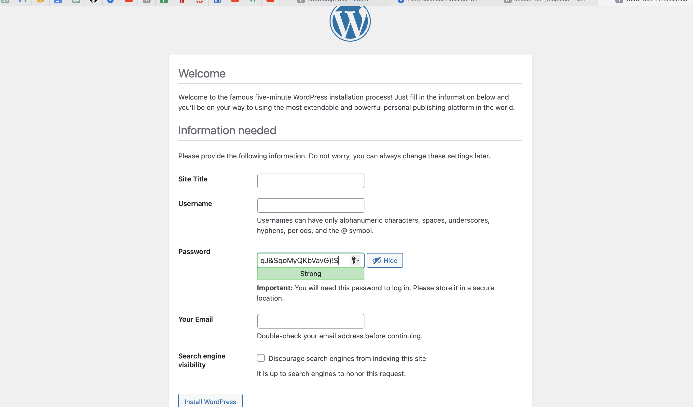
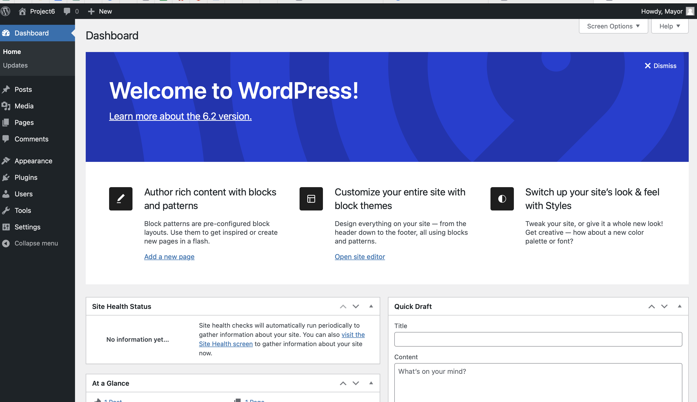
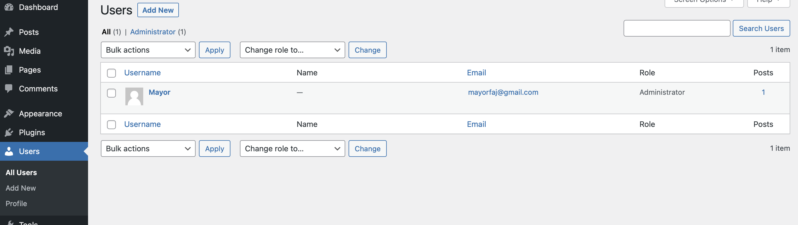

# **WEB SOLUTION WITH WORDPRESS**


- ## STEP 1

### **Prepare a Web Server**

- Launch an EC2 instance that will serve as "Web Server".
Create 3 volumes in the same AZ as your Web Server EC2, each of 10 GB

- Attach all three volumes one by one to your Web Server EC2 instance.

- open up linux command to begin configuration

- Use lsblk command to inspect what block devices are attached to the server. Notice names of your newly created devices. 

**`lsblk`**


- All devices in Linux reside in /dev/ directory. Inspect it with ls /dev/ and make sure you see all 3 newly created block devices there 

***`ls /dev/`*


- Use df -h command to see all mounts and free space on your server

**`df -h`**


- Use gdisk utility to create a single partition on each of the 3 disks. Take the following steps;

**`sudo gdisk /dev/xvdf`**


At the "Command (? for help):" prompt, type **"n"** and press Enter to start creating a new partition.
You will be prompted to specify the partition number, press enter to use default value.
Next, you will be prompted to specify the start sector of the partition. You can either specify a sector number, or press Enter to use the default value.
After specifying the start sector, you will be prompted to specify the end sector of the partition. You can either specify a sector number, or use the default value by pressing Enter.
You will then be prompted to specify the partition type. You can either enter a hexadecimal code for the partition type, or enter a string description of the partition type, here i used the partition code **"8E00"**, which indicates that the partition uses Linux LVM (Logical Volume Manager) format.
You can print the partition table with **"p"** to see the result.
Once you have completed these steps, the new partition will be created on the disk device. You can use the **"w"** command to write the changes to the partition table and exit gdisk


Now, the changes has been configured succesfully, exit out of the gdisk console and do the same for the remaining disks.

`sudo gdisk /dev/xvdg`

`sudo gdisk /dev/xvdh`

Use **lsblk** utility to view the newly configured partition on each of the 3 disks.

`lsblk`


- Install lvm2 package using 

`sudo yum install lvm2`

- check for available partitions

`sudo lvmdiskscan`


**NB;** Previously, in Ubuntu we used apt command to install packages, in RedHat/CentOS a different package manager is used, so we  used **yum** command instead

- Use **pvcreate** utility to mark each of 3 disks as physical volumes (PVs) to be used by LVM

```
sudo pvcreate /dev/xvdf1
sudo pvcreate /dev/xvdg1
sudo pvcreate /dev/xvdh1
```

- Verify that your Physical volume has been created successfully

`sudo pvs`


- Use **vgcreate** utility to add all 3 PVs to a volume group (VG). Name the VG **webdata-vg**

`sudo vgcreate webdata-vg /dev/xvdh1 /dev/xvdg1 /dev/xvdf1`

- Verify that your VG has been created successfully 

`sudo vgs`


- Use **lvcreate** utility to create 2 logical volumes. *apps-lv* (Use half of the PV size), and *logs-lv* Use the remaining space of the PV size. 
**NOTE: apps-lv will be used to store data for the Website while, logs-lv will be used to store data for logs.**


```
sudo lvcreate -n apps-lv -L 14G webdata-vg
sudo lvcreate -n logs-lv -L 14G webdata-vg
```

- Verify that your Logical Volume has been created successfully

`sudo lvs`


- Verify the entire setup

```
sudo vgdisplay -v #view complete setup - VG, PV, and LV
sudo lsblk
```


- Use mkfs.ext4 to format the logical volumes with ext4 filesystem.

```
sudo mkfs -t ext4 /dev/webdata-vg/apps-lv
sudo mkfs -t ext4 /dev/webdata-vg/logs-lv
```


- Create /var/www/html directory to store website files

`sudo mkdir -p /var/www/html`

- Create /home/recovery/logs to store backup of log data

`sudo mkdir -p /home/recovery/logs`

- Mount /var/www/html on apps-lv logical volume

`sudo mount /dev/webdata-vg/apps-lv /var/www/html/`

- Use rsync utility to backup all the files in the log directory /var/log into /home/recovery/logs (This is required before mounting the file system)

`sudo rsync -av /var/log/. /home/recovery/logs/`


- Mount /var/log on logs-lv logical volume. (Note that all the existing data on /var/log will be deleted. That is why **creating /var/www/html directory to store website files is very important.**

`sudo mount /dev/webdata-vg/logs-lv /var/log`

- Restore log files back into /var/log directory

`sudo rsync -av /home/recovery/logs/. /var/log`


- Update /etc/fstab file so that the mount configuration will persist after restart of the server
The UUID of the device will be used to update the /etc/fstab file,

- to view UUID, run

`sudo blkid`


- Open and update /etc/fstab in this format using your own UUID and rememeber to remove the leading and ending quotes

`sudo vi /etc/fstab`


- Test the configuration and reload the daemon

`sudo mount -a`

`sudo systemctl daemon-reload`

Verify the setup by running df -h, output should look like below:

`df -h`


STEP 2
## **Prepare the Database Server **

- Launch a second RedHat EC2 instance that will have a role – ‘DB Server’
-Repeat the same steps as for the **Web Server**, but instead of **apps-lv** create **db-lv** and mount it to **/db** directory instead of **/var/www/html/**
- run `df -h` to verify the setup, output should look like below


STEP 3
## ***Install WordPress on your Web Server EC2*

- Update the repository

`sudo yum -y update`


- Install wget, Apache and it’s dependencies

`sudo yum -y install wget httpd php php-mysqlnd php-fpm php-json`


- Start Apache

```
sudo systemctl enable httpd
sudo systemctl start httpd
```

- To install PHP and it’s dependencies

```
sudo yum install https://dl.fedoraproject.org/pub/epel/epel-release-latest-8.noarch.rpm

sudo yum install yum-utils http://rpms.remirepo.net/enterprise/remi-release-8.rpm

sudo yum module list php

sudo yum module reset php

sudo yum module enable php:remi-7.4

sudo yum install php php-opcache php-gd php-curl php-mysqlnd

sudo systemctl start php-fpm

sudo systemctl enable php-fpm

setsebool -P httpd_execmem 1
```

- Restart Apache

`sudo systemctl restart httpd`

- Download wordpress and copy wordpress to var/www/html

```
mkdir wordpress

cd   wordpress

sudo wget http://wordpress.org/latest.tar.gz

sudo tar xzvf latest.tar.gz

sudo rm -rf latest.tar.gz

sudo cp wordpress/wp-config-sample.php wordpress/wp-config.php

sudo cp -R wordpress /var/www/html/
```

- Configure SELinux Policies

```
sudo chown -R apache:apache /var/www/html/wordpress

sudo chcon -t httpd_sys_rw_content_t /var/www/html/wordpress -R

sudo setsebool -P httpd_can_network_connect=1
```

- Confirm SELinux configuration

`sudo sestatus`


STEP 4
## **Install MySQL on your DB Server EC2**

```
sudo yum update

sudo yum install mysql-server
```

```
sudo systemctl restart mysqld

sudo systemctl enable mysqld
```
- Verify that the service is up and running

`sudo systemctl status mysqld`


Step 5 
## **Configure DB to work with WordPress** ##

`sudo mysql`


`CREATE DATABASE wordpress;`

`CREATE USER `<myuser>`@`<Web-Server-Private-IP-Address>` IDENTIFIED BY '<mypass>';`

`GRANT ALL ON wordpress.* TO '<myuser>'@'<Web-Server-Private-IP-Address>';`

`FLUSH PRIVILEGES;`

`SHOW DATABASES;`

`exit`


Step 6
## **Configure WordPress to connect to remote database.** ##

- Open MySQL port 3306 on DB Server EC2. For extra security, access should be allowed to the DB server ONLY from your Web Server’s IP address, so in the Inbound Rule configuration specify source as /32

- Install MySQL client and test that you can connect from your **Web Server** to your DB server by using mysql-client.

`sudo yum install mysql`
`sudo mysql -u <username> -p -h <DB-Server-Private-IP-address>`

- Verify if you can successfully execute SHOW DATABASES; command and see a list of existing databases


- Change permissions and configuration so Apache could use WordPress

- cd /var/www/html/wordpress

- edit wp-config file with your DB credentials 

`sudo vi wp-config.php`


- Enable TCP port 80 in Inbound Rules configuration for your Web Server EC2 (enable from everywhere 0.0.0.0/0 or from your workstation’s IP)

- Try to access from your browser the link to your WordPress http://<Web-Server-Public-IP-Address>/wordpress/





 

- WordPress has successfully connected to your remote MySQL database


## **Linux storage susbystem has been configured and a full-scale Web Solution using WordPress CMS and MySQL RDBMS have been deployed.**


# **Thank You!**
